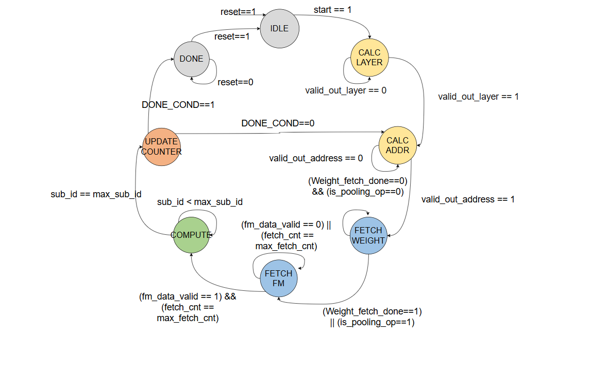
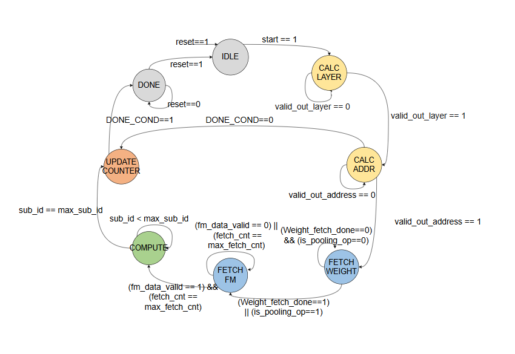

# Edge-Optimized FP16 Neural Processing Unit (NPU)

This repository provides the source code and hardware design documentation for a 16-bit floating-point (FP16) Neural Processing Unit (NPU), specifically optimized for AI applications on Edge Devices. The architecture is designed to achieve high throughput via deep pipelining and hardware resource optimization.

## 1. Key Features

* **FP16 Data Format:** Supports high-precision computations with Convolution, Pooling, Fully Connected (FC), and Point-wise (1x1 Conv) operations.
* **Deep Pipelining Architecture:** Achieves an Initiation Interval (II) of 1. The system outputs a valid FP16 result every clock cycle after an initial 30-cycle latency, completely eliminating pipeline bubbles.
* **Smart Branching FSM:** The Master Controller flexibly branches to provide a bypass datapath for FC and 1x1 operations, saving preparation cycles and entirely skipping complex Sliding Window logic.
* **Resource Optimization (Time-Multiplexing):** Utilizes time-multiplexing techniques for the FC branch, pushing data through a PISO block to share a single Activation block, saving nearly 90% of static LUT resources.
* **Control & Data Path Synchronization:** Features specialized Tag FIFOs to manage control signal latency, combined with a spring-like Shift Buffer and Credit Control mechanism to prevent data loss during pipeline bottlenecks.

## 2. System Architecture

### 2.1. Master Controller FSM

The controller uses an 8-state Finite State Machine (FSM) to strictly manage the full lifecycle of a Convolution/Pooling operation.

* **Standard Loop (Convolution/Pooling):** `IDLE` ➔ `CALC LAYER` ➔ `CALC ADDR` ➔ `FETCH WEIGHT` ➔ `FETCH FM` ➔ `COMPUTE` ➔ `UPDATE COUNTER` ➔ `DONE`.
* **One-shot Fetch for FC/Point-wise:** When the current layer is FC or 1x1, the FSM automatically bypasses the sliding window construction state (`FETCH FM`), granting simultaneous memory access for both Weights and Feature Maps in a single cycle. Data undergoes Flat Data Routing directly into the PE array inputs.

### 2.2. Processing Element (PE)

The PE block performs core operations (MAC, Max/Avg Pooling, Residual Add, ReLU, Linear, Tanh, Sigmoid) with a fixed 30-cycle latency for the standard Convolution/Pooling branch, which includes:
1. **Compute Core (20 cycles):** 9 FP16 multipliers and an Adder Tree.
2. **Intermediate Buffer (1-2 cycles):** Shift Buffer for data stabilization.
3. **Accumulation (5 cycles):** Accumulator for input channel or bias accumulation.
4. **Activation (3 cycles):** Activation function and output synchronization.

For the FC/Point-wise branch, PEs utilize a Bypass Datapath routed directly into 9 independent accumulators, reducing total latency to approximately 22 cycles.

### 2.3. Configuration & Status Registers (CSR)

Managed via four 32-bit physical registers (addressed by `bus_addr[7:0]`):
* **`0x00` - CMD_REG:** Execution control (bit [0] triggers `npu_start`).
* **`0x04` - CFG_REG:** Encodes model parameters such as `pool_mode`, `act_mode`, `is_pooling_op`, `kernel_size`, `stride`, and `is_pad_same`.
* **`0x08` - DIM_REG_1:** Stores Input Feature Map spatial dimensions (width and height).
* **`0x0C` - DIM_REG_2:** Stores channel dimensions (Input Channels, Output Channels).

Hardware automatically calculates the output spatial dimensions based on Padding, Stride, and Kernel Size, supporting maximum neural network flexibility.

## 3. Synthesis Results & Evaluation

The hardware design does not utilize DSP macros and is fully implemented using LUTs/FFs to ensure portability, achieving a maximum frequency (Fmax) of **105 MHz**.

### Table 1: Hardware Resource Utilization
| Resource | Quantity |
| :--- | :--- |
| **LUT** | 102,253 |
| **FF**  | 57,318  |
| **BRAM**| 16      |
| **DSP** | 0       |

### Table 2: Classification Model Performance
| Architecture | Dataset | Software Accuracy | Hardware Accuracy | FPS (Software) | FPS (Hardware) |
| :--- | :--- | :--- | :--- | :--- | :--- |
| **LeNet-5** | MNIST | 98.72% | 98.00% | 650.95 | 2,350.00 |
| **AlexNet** | Cifar10 | 75.32% | 69.41% | 271.47 | 57.84 |
| **ResNet18** | Vegetable | 99.50% | 97.33% | - | - |
| **ResCoNN** | GTSRB | 96.40% | 96.30% | 387.75 | 71.00 |

### Table 3: Object Detection Model Performance
| Architecture | Dataset | Environment | mAP@0.5 | Precision | F1-Score | Recall | FPS |
| :--- | :--- | :--- | :--- | :--- | :--- | :--- | :--- |
| **SSDLite-Mobilenetv2** | ASIC - VEHICLE | Software | 47.64% | 56.29% | 52.64% | 49.42% | - |
| | | Hardware | 35.00% | 35.00% | 26.00% | 21.00% | - |
| **Tiny YOLOv2** | VOC | Software | 55.47% | 60.97% | 58.00% | 55.31% | 6.26 |
| | | Hardware | 47.60% | 60.37% | 57.49% | 54.87% | 34.61 |
